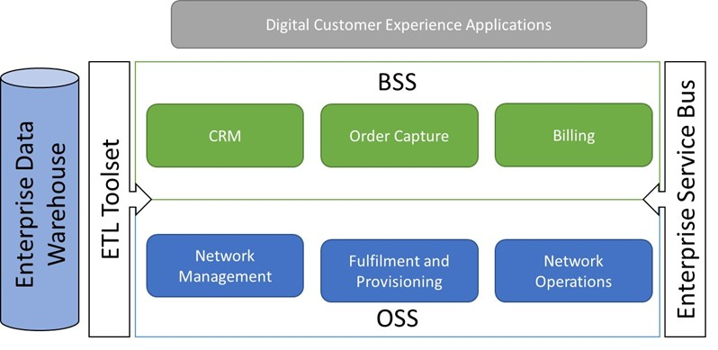
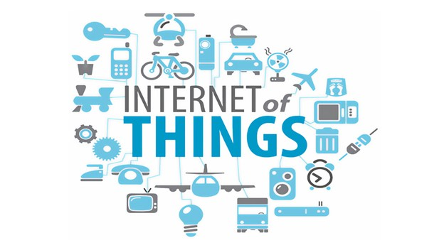
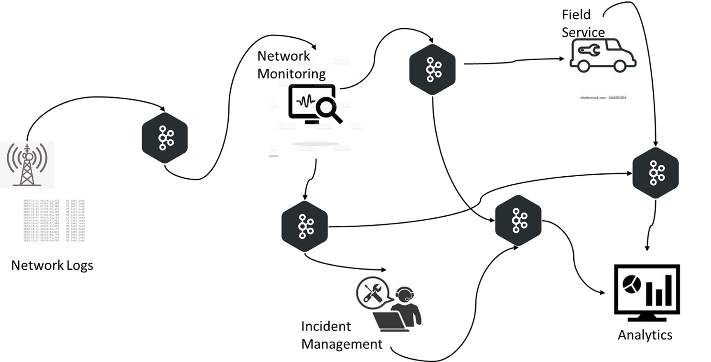
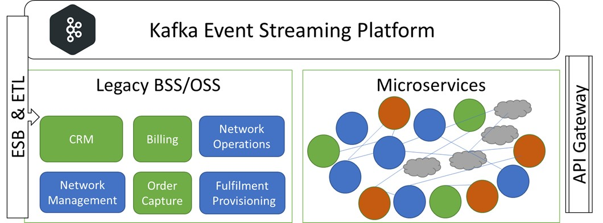
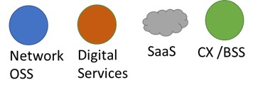

The traditional BSS/OSS paradigm that sustained in the Telco Industry for decades is now undergoing a radical transformation. BSS comprise of systems for CRM, Order Capture and Billing. Similarly for OSS it encompasses Order Fulfilment, Network Inventory Management and Network Operations.
The landscape was dominated by big vendors who offered “off-the-shelf” solutions that mysteriously needed “customization”. Most Telcos opted for a mix and match of best of breed solutions. The architecture also evolved to include an Enterprise Service Bus to integrate the systems along with ETL jobs to populate an Enterprise Data warehouse.

All these systems were designed decades ago to deal with Voice only services. They eventually adapted to deal with Data services as well. Growing demands of Digital Customer Experience meant that organizations built custom solutions to cater to these needs on top of BSS layer. The increasing volume of data and need for deeper analysis led to adoption of Big-Data technologies as well. But the underlying architecture remained essentially the same.

### What is triggering the change?

But business trends have made the present architecture inadequate. Customer Experience expectations have now evolved to a level of sophistication that needs real-time context. Telos are adopting newer business models expanding their operations into Fintech and Media/Content. Value added services built on top of 5G-IoT appears one of the most promising opportunities for future growth. These require both real-time context and analytics as a matter of necessity. Effective Monetization also depends on time-sensitive data sharing with partners.

The following table illustrates the challenges around modernization of BSS/OSS architecture and the corresponding technology solutions.

| Challenges | Solution |
| ------------- | ------------- |
| Data and computational workloads that can peak massively with very little predictability. | Containerization of Application Kubernetes as underlying Standard to support scaling.  |
| Rapid innovations in business models that demand IT agility. | Microservices oriented IT architecture and API 1st design.|
|Need for real-time understanding of customer context and immediate actions. | Event Streaming infrastructure based on Kafka as an enterprise standard. |
| Effectively reuse and monetize data/services within the organization as well as sharing with partner ecosystem.| API Gateway, Service Mesh and Event Streaming (Kafka)|
|Deliver Outstanding Customer experience and ensure Quality of Service.| API gateway, Machine Learning and Event Streaming (Kafka) |

### Use cases for Streaming in OSS/BSS

Among all the new industry standard technologies that have emerged from the Open-Source ecosystem, Kubernetes and Kafka are standouts because of their widespread adoption. Kafka as an event streaming platform is vital to implementing many use cases such as

1. Network Event monitoring (OSS)
2. Predictive Maintenance (OSS)
3. Churn Prevention/ Contextual offers (BSS/CX)
4. Monetized Location based Services (BSS/CX)
5. Fraud Detection (BSS/CX)

In addition, Kafka today is the bedrock IoT Platform services such as

1. Connected Cars and Fleet management
2. Smart Cities and Emergency response Management
3. Smart Facilities and Event Management
4. eHealth and connected wearables for wellness

### The OSS/BSS framework for the Cloud native age

Of course, it’s neither practical nor desirable to discard the legacy investments in OSS/BSS and underlying plumbing such as the ESB. For the foreseeable future, new microservices will co-exist with legacy systems. Kafka connectors can plug legacy systems to the event streaming platform. Many BSS/OSS vendors are already redesigning their upcoming releases to be “cloud-native”.
Some have already adopted the microservices mantra. Their systems have been built to use standard technology stack like Kubernetes and Kafka under the hood as well. It makes them well adapted to the emerging technology architecture.  
Here is an example of how a flexible and effective approach would look like. Existing investments in legacy BSS/OSS can be leveraged even as they are supplemented/ replaced by microservices.

As shown above, Kafka is perhaps the most essential component of the tech stack to support a cloud native BSS/OSS architecture that can deal with emerging business needs. If you are CTO or CIO of a Telco, you should be focused on this right now.
